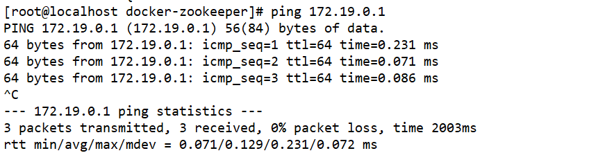
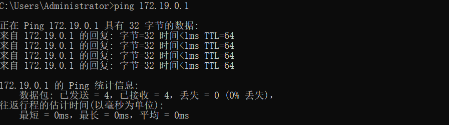

## [docker容器如何与宿主机通信](https://www.cnblogs.com/koushr/p/14559481.html)

在宿主机(windows/mac/linux)安装并启动docker后，会自动创建3个docker network：bridge、host、none。可以用docker network ls命令查看。

用docker network inspect bridge、docker network inspect host、docker network inspect none命令查看各docker network，会发现只有bridge有网段，假如是

{
​    "Subnet":"192.168.10.0/24",
​    "Gateway":"192.168.10.1"
}

一、假如宿主机是linux系统，有一个监听8000端口的其他进程

在宿主机上执行ifconfig命令，可以发现有一个docker0网卡，注意观察其网段和docker network inspect bridge的网段是一致的，宿主机在此网段下也分配了一个ip，一般是网段中的第一个ip，假如是192.168.10.1。

1）假如用默认的bridge模式启动容器，即在启动时不指定network参数或者指定了--network bridge，

在容器中执行ifconfig命令，可以发现容器的ip也在上面的网段中，假如是192.168.10.2。

在容器中，ping 192.168.10.1，可以ping通。在宿主机中ping 192.168.10.2，可以ping通。

在容器中，可以用192.168.10.1:port的方式访问宿主机的服务。

2）假如容器用host网络模式启动，即在启动时添加了--netwok host参数，

那么容器会和宿主机共享网络，直接telnet 127.0.0.1 8000可以telnet通。

 

二、假如宿主机是mac，有一个监听8000端口的其他进程

宿主机不会有docker0网卡

1）假如用默认的bridge模式启动容器

参考docker安装nginx

2）假如容器用host网络模式启动

**容器不能访问mac宿主机的服务**

3）用自定义的docker network模式启动容器

在宿主机上执行docker network create n1，用docker network inspect n1命令查看，发现n1有一个新的网段，假如是

{
​    "Subnet":"172.18.0.0/16",
​    "Gateway":"172.18.0.1"
}

在启动容器时指定--network n1

在容器中，指定ifconfig命令，可以看到容器的ip在n1的网段中，也可以看到容器的ip，假如是172.18.0.2。

在容器中ping 172.18.0.1，可以ping通。

在宿主机中ping 172.18.0.2，ping不通。在宿主机执行ifconfig命令，看不到n1。那么宿主机的ip是多少呢？

在容器中用host.docker.internal指代宿主机ip，可以通过在容器中执行ping host.docker.internal命令得到宿主机的ip。用gateway.docker.internal指代gateway，ping gateway.docker.internal可以获取到网关地址。

在容器中，telnet host.docker.internal 8000是可以telnet通的。

 

三、假如宿主机windows系统

windows电脑就不要搞docker啦！费tm半天劲也搞不好


#搭建docker网络（亲测）

### 1、自定义创建docker网桥，指定子网

docker network create **zkkf-net** --subnet 172.19.0.0/16 --gateway 172.19.0.1

```shell
[root@localhost docker-zookeeper]# docker network create zkkf-net --subnet 172.19.0.0/16 --gateway 172.19.0.1
a1f471e59b1fbc11b7f3e043a010d4b0ada98715580ea0a1baf59da8ab0da5bd

```

* 查看网桥列表：

[root@localhost docker-zookeeper]# docker network ls

NETWORK ID          NAME                   DRIVER              SCOPE
a2a46a624c63        bridge                 bridge              local
ed1ab10ce80d        docker-spark_default   bridge              local
d8bd90132281        host                   host                local
9f47f942cb56        none                   null                local
a1f471e59b1f        **zkkf-net**               bridge              local


* 查看**zkkf-net**网桥的ip

> [root@localhost docker-zookeeper]# docker network inspect zkkf-net
> [
>
>     {
>         "Name": "zkkf-net",
>         "Id": "a1f471e59b1fbc11b7f3e043a010d4b0ada98715580ea0a1baf59da8ab0da5bd",
>         "Created": "2022-04-22T16:14:03.102459012+08:00",
>         "Scope": "local",
>         "Driver": "bridge",
>         "EnableIPv6": false,
>         "IPAM": {
>             "Driver": "default",
>             "Options": {},
>             "Config": [
>                 {
>                     "Subnet": "172.19.0.0/16",
>                     "Gateway": "172.19.0.1"
>                 }
>             ]
>         },
>         "Internal": false,
>         "Attachable": false,
>         "Ingress": false,
>         "ConfigFrom": {
>             "Network": ""
>         },
>         "ConfigOnly": false,
>         "Containers": {
>             "2651a9e095524958a1c98cea595ef3154786a0606f4825a93c82f60c9a3bd182": {
>                 "Name": "zoo1",
>                 "EndpointID": "111ac4455907cba20bf1984b096d214d4553fc1c3545ffd394c5f2d0c2b58708",
>                 "MacAddress": "02:42:ac:13:00:15",
>                 "IPv4Address": "172.19.0.21/16",
>                 "IPv6Address": ""
>             },
>             "714f78bb216e7b5ef7af8900500e4287b6beaa593a0fe95cdb8f1ecf0f54a42f": {
>                 "Name": "zoo3",
>                 "EndpointID": "2d1b4c31567f5fa3b00ed010fe5e4c44b2d12a5c679f9591a1be5442219c608e",
>                 "MacAddress": "02:42:ac:13:00:17",
>                 "IPv4Address": "172.19.0.23/16",
>                 "IPv6Address": ""
>             },
>             "e3fb4bf16d6622c8921386d421d9d5af53e299afa617136c9f601e3600b890e6": {
>                 "Name": "zoo2",
>                 "EndpointID": "bc2e1d2af2f112525ec554931bfcbcb2f5ba6f56a59e96d4c42e2bd2f0340ca6",
>                 "MacAddress": "02:42:ac:13:00:16",
>                 "IPv4Address": "172.19.0.22/16",
>                 "IPv6Address": ""
>             }
>         },
>         "Options": {},
>         "Labels": {}
>     }
> ]

* 子网范围和网关为：

         "Subnet": "172.19.0.0/16",
         "Gateway": "172.19.0.1"
* 测试宿主机与该网桥的网关连接：



### 2、在Windows中设置路由以访问

route add 172.19.0.0/24 mask 255.255.255.255 192.168.10.10

其中：172.19.0.0/24 为网段，意为172.19.0.0-172.19.0.225

* 测试连接

  

