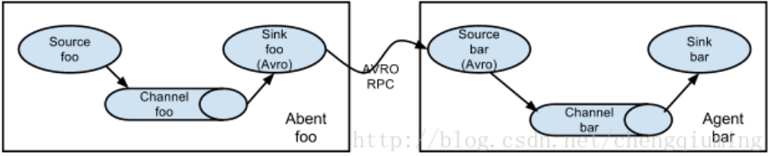

# flume通过avro对接（汇总数据），将数据发送到kafka

[apache flume官网](https://flume.apache.org/)

监听Avro端口来接受外部avro客户端的事件流，和netcat不同的是，avro-source接收到的是经过avro序列化之后的数据，然后反序列化数据继续传输，所以，如果avro-source的话，源数据必须是经过avro序列化之后的数据。而netcat接收的是字符串格式的数据。



本次采用flume1 agent (netcat_source_avro_sink)  --> flume2 agent(avro_source_kafka_sink) 数据流模式。即通过flume1 收集数据 发送给flume2，flume2将数据交给kafka存储。


* flume1 容器：

​                 ip：172.19.0.12 

​                 暴露agent端口 ：4141

* flume2 容器

  ip：172.19.0.13 

   暴露agent端口 ：4545

####1.创建flume2 agent，定义avro source 和 kafka sink

> [root@localhost conf]# docker exec -it flume2 bash

```shell
root@32f1cd11b9d4:/opt/flume-config/flume.conf# vim avro_source_kafka_sink.conf

# example.conf: A single-node Flume configuration

# Name the components on this agent
a1.sources = r1
a1.sinks = k1
a1.channels = c1

# Describe/configure the source
a1.sources.r1.type = avro
a1.sources.r1.bind = 0.0.0.0
a1.sources.r1.port = 4545


# Describe the sink
a1.sinks.k1.type = org.apache.flume.sink.kafka.KafkaSink
a1.sinks.k1.kafka.topic = flume_topic01
a1.sinks.k1.kafka.bootstrap.servers = 172.19.0.31:9092,172.19.0.32:9093,172.19.0.33:9094
a1.sinks.k1.kafka.flumeBatchSize = 20
a1.sinks.k1.kafka.producer.acks = 1
a1.sinks.k1.kafka.producer.linger.ms = 1
a1.sinks.k1.kafka.producer.compression.type = snappy


# Use a channel which buffers events in memory
a1.channels.c1.type = memory
a1.channels.c1.capacity = 1000
a1.channels.c1.transactionCapacity = 100
"avro_source_kafka_sink.conf" 31L, 870C
```

####2.创建flume1 agent，定义netcat source 和 avro sink

> [root@localhost conf]# docker exec -it flume1 bash

```shell
root@03a91ff80946:/opt/flume-config/flume.conf# vim netcat_source_avro_sink.conf

# example.conf: A single-node Flume configuration

# Name the components on this agent
a1.sources = r1
a1.sinks = k1
a1.channels = c1

# Describe/configure the source
a1.sources.r1.type = netcat
a1.sources.r1.bind =0.0.0.0
a1.sources.r1.port = 4141

# Describe the sink
a1.sinks.k1.type = avro
a1.sinks.k1.hostname = 172.19.0.13
a1.sinks.k1.port = 4545


# Use a channel which buffers events in memory
a1.channels.c1.type = memory
a1.channels.c1.capacity = 1000
a1.channels.c1.transactionCapacity = 100

# Bind the source and sink to the channel
a1.sources.r1.channels = c1
a1.sinks.k1.channel = c1

```

####3.创建kafka topic

> bash-5.1#  **bin/kafka-topics.sh --create --bootstrap-server 172.19.0.31:9092 --replication-factor 2 --partitions 3 --topic flume_topic01**
> WARNING: Due to limitations in metric names, topics with a period ('.') or underscore ('_') could collide. To avoid issues it is best to use either, but not both.
> Created topic flume_topic01.
> bash-5.1#   **bin/kafka-topics.sh  --bootstrap-server 172.19.0.31:9092  --topic flume_topic01 --describe**
> Topic: flume_topic01	TopicId: EBAbXwO4QtW1LMK8l4LM0g	PartitionCount: 3	ReplicationFactor: 2	Configs: segment.bytes=1073741824
>
> Topic: flume_topic01	Partition: 0	Leader: 1001	Replicas: 1001,1002	Isr: 1001,1002
> Topic: flume_topic01	Partition: 1	Leader: 1003	Replicas: 1003,1001	Isr: 1003,1001
> Topic: flume_topic01	Partition: 2	Leader: 1002	Replicas: 1002,1003	Isr: 1002,1003

####4.启动flume2 agent

> root@32f1cd11b9d4:/opt/flume# **bin/flume-ng agent --conf conf --conf-file /opt/flume-config/flume.conf/avro_source_kafka_sink.conf --name a1**
> Info: Including Hive libraries found via () for Hive access
>
> - exec /opt/java/bin/java -Xmx20m -cp '/opt/flume/conf:/opt/flume/lib/*:/lib/*' -Djava.library.path= org.apache.flume.node.Application --conf-file /opt/flume-config/flume.conf/avro_source_kafka_sink.conf --name a1

####5.启动flume1 agent

> root@03a91ff80946:/opt/flume# **bin/flume-ng agent --conf conf --conf-file /opt/flume-config/flume.conf/netcat_source_avro_sink.conf --name a1**
> Info: Including Hive libraries found via () for Hive access
>
> - exec /opt/java/bin/java -Xmx20m -cp '/opt/flume/conf:/opt/flume/lib/*:/lib/*' -Djava.library.path= org.apache.flume.node.Application --conf-file /opt/flume-config/flume.conf/netcat_source_avro_sink.conf --name a1

#### 6.启动kafka-console-consumer消费测试

向flume1发送消息：

> [root@localhost conf]#  **telnet 172.19.0.12 4141**
> Trying 172.19.0.12...
> Connected to 172.19.0.12.
> Escape character is '^]'.
> 1111
> OK
> 2222
> OK
> 3333
> OK
> 4444
> OK
> 5555
> OK
> 6666
> OK
> 7777
> OK
> 8888
> OK
> 9999
> OK
> 10101010
> OK
> 11111111
> OK
> 12121212
> OK
> 13131313
> OK

消费：

> bash-5.1#  **bin/kafka-console-consumer.sh --bootstrap-server 172.19.0.32:9093 --topic flume_topic01 --from-beginning**
> 3333
> 6666
> 9999
> 2222
> 5555
> 8888
> 1111
> 4444
> 7777
> 10101010
> 11111111
> 12121212
> 13131313