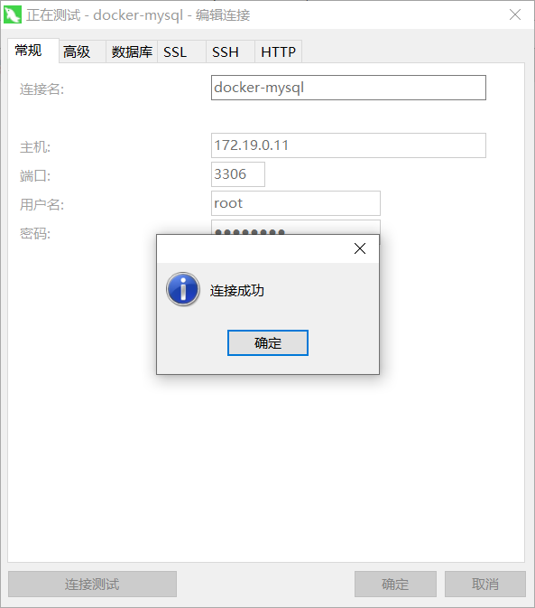

# docker安装mysql5.7

#### 1.拉取镜像

> [root@localhost ~]# docker pull mysql:5.7
> 5.7: Pulling from library/mysql
> 72a69066d2fe: Pull complete
> 93619dbc5b36: Pull complete
> 99da31dd6142: Pull complete
> 626033c43d70: Pull complete
> 37d5d7efb64e: Pull complete
> ac563158d721: Pull complete
> d2ba16033dad: Pull complete
> 0ceb82207cd7: Pull complete
> 37f2405cae96: Pull complete
> e2482e017e53: Pull complete
> 70deed891d42: Pull complete
> Digest: sha256:f2ad209efe9c67104167fc609cca6973c8422939491c9345270175a300419f94
> Status: Downloaded newer image for mysql:5.7

#### 2.查看镜像

> [root@localhost ~]# docker images
> REPOSITORY             TAG                 IMAGE ID            CREATED             SIZE
> wurstmeister/kafka     latest              2dd91ce2efe1        3 months ago        508MB
> zookeeper              latest              36c607e7b14d        4 months ago        278MB
> mysql                  5.7                 c20987f18b13        4 months ago        448MB
> bde2020/spark-master   3.2.0-hadoop3.2     3d161dc0595b        4 months ago        545MB
> bde2020/spark-worker   3.2.0-hadoop3.2     cb570e0e37b4        4 months ago        545MB
> dushixiang/kafka-map   latest              b711e1fb5c60        5 months ago        295MB
> hello-world            latest              feb5d9fea6a5        7 months ago        13.3kB

#### 3.指定网络运行

> docker run \
> -p 3306:3306 \
> --name mysql \
> --network zkkf-net \
> --ip 172.19.0.11 \
> -v /home/docker_apps/docker-mysql/conf:/etc/mysql/conf.d \
> -v /home/docker_apps/docker-mysql/logs:/logs \
> -v /home/docker_apps/docker-mysql/data:/var/lib/mysql \
> -e MYSQL_ROOT_PASSWORD=861991y_ \
> -d mysql:5.7

#### 4.查看ip

> [root@localhost docker-mysql]# docker inspect mysql | grep -i ipa
>
>             "SecondaryIPAddresses": null,
>             "IPAddress": "",
>                     "IPAMConfig": {
>                     "IPAddress": "172.19.0.11",

#### 5.登录

> root@09abeff375fb:/# mysql -uroot -p861991y_
> mysql: [Warning] Using a password on the command line interface can be insecure.
> Welcome to the MySQL monitor.  Commands end with ; or \g.
> Your MySQL connection id is 3
> Server version: 5.7.36 MySQL Community Server (GPL)
>
> Copyright (c) 2000, 2021, Oracle and/or its affiliates.
>
> Oracle is a registered trademark of Oracle Corporation and/or its
> affiliates. Other names may be trademarks of their respective
> owners.
>
> Type 'help;' or '\h' for help. Type '\c' to clear the current input statement.
>
> mysql>

#### 6.开放端口

> [root@localhost ~]# firewall-cmd --permanent --add-port=3306/tcp
> success
> [root@localhost ~]# firewall-cmd --reload
> success
> [root@localhost ~]#
> [root@localhost ~]#
> [root@localhost ~]# firewall-cmd --query-port=3306/tcp
> yes

#### 7.测试

