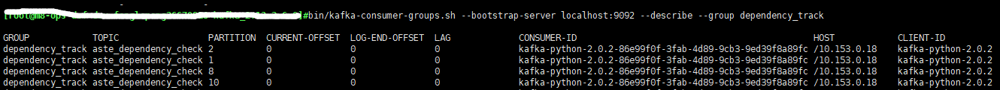

# kafka相关脚本使用

## [kafka](https://so.csdn.net/so/search?q=kafka&spm=1001.2101.3001.7020) 脚本

```pascal
connect-distributed.sh
connect-mirror-maker.sh
connect-standalone.sh
kafka-acls.sh
kafka-broker-api-versions.sh
kafka-configs.sh
kafka-console-consumer.sh
kafka-console-producer.sh
kafka-consumer-groups.sh
kafka-consumer-perf-test.sh
kafka-delegation-tokens.sh
kafka-delete-records.sh
kafka-dump-log.sh
kafka-leader-election.sh
kafka-log-dirs.sh
kafka-mirror-maker.sh
kafka-preferred-replica-election.sh
kafka-producer-perf-test.sh
kafka-reassign-partitions.sh
kafka-replica-verification.sh
kafka-run-class.sh
kafka-server-start.sh
kafka-server-stop.sh
kafka-streams-application-reset.sh
kafka-topics.sh
kafka-verifiable-consumer.sh
kafka-verifiable-producer.sh
trogdor.sh
windows
zookeeper-security-migration.sh
zookeeper-server-start.sh
zookeeper-server-stop.sh
zookeeper-shell.sh
```

## 集群管理

```pascal
# 启动zookeeper
bin/zookeeper-server-start.sh config/zookeeper.properties &


# 停止zookeeper
bin/zookeeper-server-stop.sh


# 前台启动broker Ctrl + C 关闭
bin/kafka-server-start.sh <path>/server.properties


# 后台启动broker
bin/kafka-server-start.sh -daemon <path>/server.properties


# 关闭broker
bin/kafka-server-stop.sh

```

## topic相关

```pascal
# 创建topic（4个分区，2个副本）
bin/kafka-topics.sh --create --zookeeper localhost:2181 --replication-factor 2 --partitions 4 --topic test
# kafka版本 >= 2.2
bin/kafka-topics.sh --create --bootstrap-server localhost:9092 --replication-factor 1 --partitions 1 --topic test
    --create：指定创建topic动作
    --topic：指定新建topic的名称
    --zookeeper： 指定kafka连接zk的连接url，该值和server.properties文件中的配置项{zookeeper.connect}一样
    --partitions：指定当前创建的kafka分区数量，默认为1个
    --replication-factor：指定每个分区的复制因子个数，默认1个


# 分区扩容，注意：分区数量只能增加，不能减少
# kafka版本 < 2.2
bin/kafka-topics.sh --zookeeper localhost:2181 --alter --topic topic1 --partitions 2
# kafka版本 >= 2.2
bin/kafka-topics.sh --bootstrap-server broker_host:port --alter --topic topic1 --partitions 2


# 删除topic
bin/kafka-topics.sh --zookeeper localhost:2181 --delete --topic test


# 查询topic列表
bin/kafka-topics.sh --zookeeper 127.0.0.1:2181 --list
# 查询topic列表（支持0.9版本+）
bin/kafka-topics.sh --list --bootstrap-server localhost:9092


# 查看所有topic的详细信息
bin/kafka-topics.sh --zookeeper 127.0.0.1:2181 --describe 


# 查询topic详情
bin/kafka-topics.sh --zookeeper localhost:2181 --describe --topic topicname

```

## 消费者组

查看consumer group列表有新、旧两种命令，分别查看新版(信息保存在broker中)consumer列表和老版(信息保存在zookeeper中)consumer列表，因而需要区分指定bootstrap–server和zookeeper参数

```pascal
# 新消费者列表查询（支持0.9版本+）
bin/kafka-consumer-groups.sh --new-consumer --bootstrap-server localhost:9092 --list
# 消费者列表查询（支持0.10版本+）
bin/kafka-consumer-groups.sh --bootstrap-server localhost:9092 --list


# 显示某个消费组的消费详情（仅支持offset存储在zookeeper上的）
bin/kafka-run-class.sh kafka.tools.ConsumerOffsetChecker --zookeeper localhost:2181 --group test
# 显示某个新消费组的消费详情（0.9版本 - 0.10.1.0 之前）
bin/kafka-consumer-groups.sh --new-consumer --bootstrap-server localhost:9092 --describe --group my-group
## 显示某个消费组的消费详情（0.10.1.0版本+）
bin/kafka-consumer-groups.sh --bootstrap-server localhost:9092 --describe --group my-group


# 重设消费者组位移
# 最早处
bin/kafka-consumer-groups.sh --bootstrap-server localhost:9092 --group groupname --reset-offsets --all-topics --to-earliest --execute
# 最新处
bin/kafka-consumer-groups.sh --bootstrap-server localhost:9092 --group groupname --reset-offsets --all-topics --to-latest --execute
# 某个位置
bin/kafka-consumer-groups.sh --bootstrap-server localhost:9092 --group groupname --reset-offsets --all-topics --to-offset 2000 --execute
# 调整到某个时间之后的最早位移
bin/kafka-consumer-groups.sh --bootstrap-server localhost:9092 --group groupname --reset-offsets --all-topics --to-datetime 2019-09-15T00:00:00.000


# 删除消费者组
bin/kafka-consumer-groups.sh --zookeeper localhost:2181 --delete --group groupname

```

### 显示某个消费组的消费详情



各字段含义如下:

| TOPIC   | PARTITION | CURRENT-OFFSET | LOG-END-OFFSET | LAG    | CONSUMER-ID | HOST | CLIENT-ID |
| ------- | --------- | -------------- | -------------- | ------ | ----------- | ---- | --------- |
| topic名字 | 分区id      | 当前已消费的条数       | 总条数            | 未消费的条数 | 消费id        | 主机ip | 客户端id     |


## 发送和消费:

```pascal
# 生产者
bin/kafka-console-producer.sh --broker-list localhost:9092 --topic test

# 消费者,其中"--from-beginning"为可选参数，表示要从头消费消息
bin/kafka-console-consumer.sh --bootstrap-server localhost:9092 --topic topicname --from-beginning
# 指定groupid
bin/kafka-console-consumer.sh --bootstrap-server localhost:9092 --topic topicname --from-beginning --consumer-property group.id=old-consumer-group
# 指定分区
bin/kafka-console-consumer.sh --bootstrap-server localhost:9092 --topic topicname --from-beginning --partition 0

# 新生产者（支持0.9版本+）
bin/kafka-console-producer.sh --broker-list localhost:9092 --topic test --producer.config config/producer.properties

# 新消费者（支持0.9版本+）
bin/kafka-console-consumer.sh --bootstrap-server localhost:9092 --topic test --new-consumer --from-beginning --consumer.config config/consumer.properties

# kafka-verifiable-consumer.sh（消费者事件，例如：offset提交等）
bin/kafka-verifiable-consumer.sh --broker-list localhost:9092 --topic test --group-id groupName

# 高级点的用法
bin/kafka-simple-consumer-shell.sh --brist localhost:9092 --topic test --partition 0 --offset 1234  --max-messages 10

```

## 切换leader

```pascal
# kafka版本 <= 2.4
bin/kafka-preferred-replica-election.sh --zookeeper zk_host:port/chroot

# kafka新版本
bin/kafka-preferred-replica-election.sh --bootstrap-server broker_host:port

```

## kafka自带压测命令:

```pascal
bin/kafka-producer-perf-test.sh --topic test --num-records 100 --record-size 1 --throughput 100  --producer-props bootstrap.servers=localhost:9092

```


## kafka持续发送消息:

持续发送消息到指定的topic中，且每条发送的消息都会有响应信息：

```pascal
kafka-verifiable-producer.sh --broker-list $(hostname -i):9092 --topic test --max-messages 100000

```

## zookeeper-shell.sh

如果kafka集群的zk配置了chroot路径，那么需要加上`/path`。

```pascal
bin/zookeeper-shell.sh localhost:2181[/path]
ls /brokers/ids
get /brokers/ids/0

```

## 迁移分区:

* 创建规则json

  ```pascal
  cat > increase-replication-factor.json <<EOF
  {"version":1, "partitions":[
  {"topic":"__consumer_offsets","partition":0,"replicas":[0,1]},
  {"topic":"__consumer_offsets","partition":1,"replicas":[0,1]},
  {"topic":"__consumer_offsets","partition":2,"replicas":[0,1]},
  {"topic":"__consumer_offsets","partition":3,"replicas":[0,1]},
  {"topic":"__consumer_offsets","partition":4,"replicas":[0,1]},
  {"topic":"__consumer_offsets","partition":5,"replicas":[0,1]},
  {"topic":"__consumer_offsets","partition":6,"replicas":[0,1]},
  {"topic":"__consumer_offsets","partition":7,"replicas":[0,1]},
  {"topic":"__consumer_offsets","partition":8,"replicas":[0,1]},
  {"topic":"__consumer_offsets","partition":9,"replicas":[0,1]},
  {"topic":"__consumer_offsets","partition":10,"replicas":[0,1]},
  {"topic":"__consumer_offsets","partition":11,"replicas":[0,1]},
  {"topic":"__consumer_offsets","partition":12,"replicas":[0,1]},
  {"topic":"__consumer_offsets","partition":13,"replicas":[0,1]},
  {"topic":"__consumer_offsets","partition":14,"replicas":[0,1]},
  {"topic":"__consumer_offsets","partition":15,"replicas":[0,1]},
  {"topic":"__consumer_offsets","partition":16,"replicas":[0,1]},
  {"topic":"__consumer_offsets","partition":17,"replicas":[0,1]},
  {"topic":"__consumer_offsets","partition":18,"replicas":[0,1]},
  {"topic":"__consumer_offsets","partition":19,"replicas":[0,1]},
  {"topic":"__consumer_offsets","partition":20,"replicas":[0,1]},
  {"topic":"__consumer_offsets","partition":21,"replicas":[0,1]},
  {"topic":"__consumer_offsets","partition":22,"replicas":[0,1]},
  {"topic":"__consumer_offsets","partition":23,"replicas":[0,1]},
  {"topic":"__consumer_offsets","partition":24,"replicas":[0,1]},
  {"topic":"__consumer_offsets","partition":25,"replicas":[0,1]},
  {"topic":"__consumer_offsets","partition":26,"replicas":[0,1]},
  {"topic":"__consumer_offsets","partition":27,"replicas":[0,1]},
  {"topic":"__consumer_offsets","partition":28,"replicas":[0,1]},
  {"topic":"__consumer_offsets","partition":29,"replicas":[0,1]},
  {"topic":"__consumer_offsets","partition":30,"replicas":[0,1]},
  {"topic":"__consumer_offsets","partition":31,"replicas":[0,1]},
  {"topic":"__consumer_offsets","partition":32,"replicas":[0,1]},
  {"topic":"__consumer_offsets","partition":33,"replicas":[0,1]},
  {"topic":"__consumer_offsets","partition":34,"replicas":[0,1]},
  {"topic":"__consumer_offsets","partition":35,"replicas":[0,1]},
  {"topic":"__consumer_offsets","partition":36,"replicas":[0,1]},
  {"topic":"__consumer_offsets","partition":37,"replicas":[0,1]},
  {"topic":"__consumer_offsets","partition":38,"replicas":[0,1]},
  {"topic":"__consumer_offsets","partition":39,"replicas":[0,1]},
  {"topic":"__consumer_offsets","partition":40,"replicas":[0,1]},
  {"topic":"__consumer_offsets","partition":41,"replicas":[0,1]},
  {"topic":"__consumer_offsets","partition":42,"replicas":[0,1]},
  {"topic":"__consumer_offsets","partition":43,"replicas":[0,1]},
  {"topic":"__consumer_offsets","partition":44,"replicas":[0,1]},
  {"topic":"__consumer_offsets","partition":45,"replicas":[0,1]},
  {"topic":"__consumer_offsets","partition":46,"replicas":[0,1]},
  {"topic":"__consumer_offsets","partition":47,"replicas":[0,1]},
  {"topic":"__consumer_offsets","partition":48,"replicas":[0,1]},
  {"topic":"__consumer_offsets","partition":49,"replicas":[0,1]}]
  }
  EOF
  ```

  * 执行

    ```pascal
    bin/kafka-reassign-partitions.sh --zookeeper localhost:2181 --reassignment-json-file increase-replication-factor.json --execute

    ```

  * 验证

    ```pascal
    bin/kafka-reassign-partitions.sh --zookeeper localhost:2181 --reassignment-json-file increase-replication-factor.json --verify

    ```

  ## MirrorMaker 跨机房灾备工具

  ```pascal
  bin/kafka-mirror-maker.sh --consumer.config consumer.properties --producer.config producer.properties --whitelist topicA|topicB

  ```

  ​